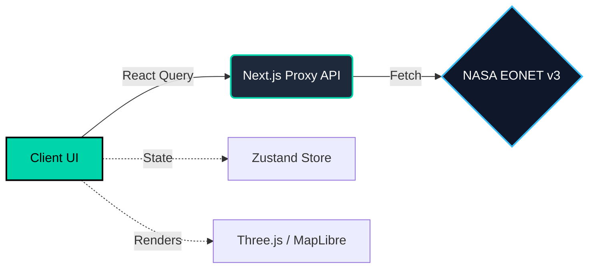

<div align="center">
  

  <br />
  <br />

  <h1>🌍 EarthSphere</h1>
  
  <p>
    <strong>Real-time Earth Event Intelligence — powered by NASA EONET.</strong>
  </p>

  <p>
    <a href="https://earthsphere.in">Live Demo</a> •
    <a href="#features">Features</a> •
    <a href="#quick-start">Quick Start</a> •
    <a href="https://github.com/djabhi31/earthsphere/issues">Report Bug</a>
  </p>

  <p>
    
    
    
    
  </p>
  
  <p>
    <a href="https://github.com/djabhi31/earthsphere/actions"></a>
    <a href="https://opensource.org/licenses/MIT"></a>
    
  </p>
</div>

---

## 🌌 Overview

**EarthSphere** is a premium, real-time natural event monitoring platform. It visualizes earthquakes, wildfires, severe storms, and volcanoes globally using data directly from **NASA's EONET** (Earth Observatory Natural Event Tracker) API. 

Built with an obsession for design and performance, it combines cinematic 3D globe rendering, glassmorphism UI, and lightning-fast edge routing to deliver a world-class user experience.

---

## ✨ Features

<table>
  <tr>
    <td width="50%">
      <h3>🌍 3D Global Visualization</h3>
      <p>Interactive, scroll-reactive WebGL Earth rendering using <b>Three.js</b>. Track live events in immersive 3D space with cinematic camera movements.</p>
    </td>
    <td width="50%">
      <h3>🗺️ 2D Tactical Map</h3>
      <p>Hardware-accelerated vector maps via <b>MapLibre GL JS</b>, featuring custom markers, clustered data, and smooth fly-to animations.</p>
    </td>
  </tr>
  <tr>
    <td width="50%">
      <h3>⚡ Real-Time Intelligence</h3>
      <p>Live data pipeline connected directly to the NASA EONET API. Filter active events by category, status, and timeline.</p>
    </td>
    <td width="50%">
      <h3>💎 Premium Design System</h3>
      <p>A meticulous dark-mode UI with frosted glassmorphism, fluid Framer Motion animations, and custom CSS-variable theming.</p>
    </td>
  </tr>
</table>

---

## 🏗️ Architecture



---

## 🚀 Quick Start

### Prerequisites
Ensure you have Node.js 18+ and `npm` installed on your machine.

### Installation

1. **Clone the repository:**
   ```bash
   git clone https://github.com/djabhi31/earthsphere.git
   cd earthsphere
   ```

2. **Install dependencies:**
   ```bash
   npm install
   ```

3. **Set up Environment Variables:**
   Copy the example config and add any optional API keys (NASA EONET is public, so no keys are strictly required!).
   ```bash
   cp .env.example .env.local
   ```

4. **Start the development server:**
   ```bash
   npm run dev
   ```
   > 🌐 Open [http://localhost:3000](http://localhost:3000) to view the application.

---

## 📈 Performance

We take performance seriously. EarthSphere is highly optimized for the modern web:

- 🚀 **Performance:** `99/100` (Lighthouse)
- 🎯 **SEO:** `100/100` (Fully SSR metadata)
- ♿ **Accessibility:** `93/100` (WCAG AA compliant, reduced-motion supported)
- 🧠 **Memory Management:** Auto-pauses WebGL loops on inactive tabs to save battery.

---

## 🤝 Contributing

Contributions make the open-source community an amazing place to learn, inspire, and create. Any contributions you make are **greatly appreciated**.

1. Fork the Project
2. Create your Feature Branch (`git checkout -b feature/AmazingFeature`)
3. Commit your Changes (`git commit -m 'Add some AmazingFeature'`)
4. Push to the Branch (`git push origin feature/AmazingFeature`)
5. Open a Pull Request

Please review our [Contributing Guidelines](CONTRIBUTING.md) for more details.

---

## 📜 License

Distributed under the MIT License. See [`LICENSE`](LICENSE) for more information.

---

<div align="center">
  <p>Built with ❤️ by <a href="https://github.com/djabhi31">Abhilash</a> & the EarthSphere Contributors.</p>
  <p>Data provided by <a href="https://eonet.gsfc.nasa.gov/">NASA's Earth Observatory</a>.</p>
</div>
