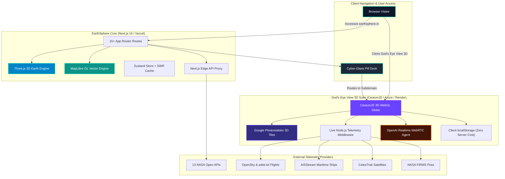

<div align="center">
  

  <br />
  <br />

  <h1>🌍 EarthSphere & 🛰️ God's Eye View Suite</h1>
  
  <p>
    <strong>The Executive NASA Earth & Deep Space Intelligence Engine — Photorealistic 3D Tactical Globe, 13 NASA Open APIs, Live Aircraft/Maritime/Satellite Telemetry, and Realtime AI Voice Operations.</strong>
  </p>

  <p>
    <a href="https://earthsphere.in"><b>🌐 Live EarthSphere</b></a> •
    <a href="https://godseyeview.earthsphere.in"><b>🛰️ Live God's Eye View (3D)</b></a> •
    <a href="#-dual-suite-architecture"><b>🏗️ Architecture</b></a> •
    <a href="#-tactical-features-matrix"><b>✨ Features</b></a> •
    <a href="#-integrated-data-streams-19"><b>📡 Telemetry Sources</b></a> •
    <a href="#-byok-security-architecture"><b>🔑 BYOK Security</b></a> •
    <a href="#-quick-start"><b>🚀 Quick Start</b></a> •
    <a href="https://github.com/djabhi31/EarthSphere/issues"><b>🐛 Report Bug</b></a>
  </p>

  <p>
    
    
    
    
    
    
    
  </p>
  
  <p>
    <a href="https://github.com/djabhi31/EarthSphere/actions/workflows/ci.yml"></a>
    <a href="https://opensource.org/licenses/MIT"></a>
    <a href="https://api.nasa.gov/"></a>
    <a href="https://github.com/djabhi31/gods-eye-view"></a>
    
  </p>
</div>

---

## 🌌 The Vision

> *"Half the magic is that it looks like a forbidden NORAD planetary command center. The other half is that every single byte of data is real, live, and public."*

**EarthSphere** bridges deep planetary science with real-time geospatial tactical intelligence into a single unified monorepo suite:

1. **EarthSphere Core Web ([earthsphere.in](https://earthsphere.in))**: An executive space intelligence portal consuming **13 official NASA Open APIs** across 15+ interactive pages — tracking everything from active natural disasters (wildfires, volcanoes, tsunamis) to solar flares, geomagnetic storms, near-Earth asteroids, and Mars rover camera feeds.
2. **God's Eye View Tactical Console ([godseyeview.earthsphere.in](https://godseyeview.earthsphere.in))**: A cinematic 3D spy-satellite simulator powered by **CesiumJS** and **Google Photorealistic 3D Tiles** that renders live global aircraft cockpits, real-time cargo vessels, orbital satellite constellations, city CCTV camera projections, and hands-free voice control.

Designed with an ultra-clean **cyber-glass aesthetic**, the suite operates with **zero cost for the host** via an air-gapped **BYOK (Bring Your Own Key)** architecture saved safely in the visitor's private browser `localStorage`.

---

## 🎛️ Dual-Suite Capabilities Matrix

<table>
  <thead>
    <tr>
      <th width="50%">🌍 EarthSphere Core Engine (<a href="https://earthsphere.in">earthsphere.in</a>)</th>
      <th width="50%">🛰️ God's Eye View 3D Console (<a href="https://godseyeview.earthsphere.in">godseyeview.earthsphere.in</a>)</th>
    </tr>
  </thead>
  <tbody>
    <tr>
      <td valign="top">
        <ul>
          <li><b>13 Official NASA Open APIs:</b> Real-time ingestion of EONET v3, DONKI, NeoWs, APOD, EPIC, Mars, Landsat, TechPort & more.</li>
          <li><b>Scroll-Reactive WebGL Earth:</b> Three.js globe with custom atmospheric glow shaders, particle rings & camera fly-to orbits.</li>
          <li><b>2D Tactical Vector Map:</b> Hardware-accelerated MapLibre GL JS engine with geospatial clustering and categorization.</li>
          <li><b>Cosmic Radar:</b> Near-Earth Object (NeoWs) asteroid velocities, threat ratings, and CNEOS fireball atmospheric impacts.</li>
          <li><b>Space Weather Operations:</b> DONKI live solar flares, Coronal Mass Ejections (CMEs), and geomagnetic disturbance alerts.</li>
          <li><b>Multi-Rover Photography:</b> High-res feeds from Curiosity, Perseverance, and Opportunity across Martian Sols.</li>
          <li><b>Cyber-Glass Pill Dock:</b> Floating mega-menu navigation dock with multi-accent theme switching (Cyan, Orange, Emerald, Purple).</li>
        </ul>
      </td>
      <td valign="top">
        <ul>
          <li><b>Photorealistic 3D Planet:</b> Sub-meter Cesium ion terrain & Google Photorealistic 3D Tiles with elevation holding.</li>
          <li><b>🛩️ Live Cockpit Mode:</b> Ride inside tracked aircraft — camera hugs the ground with active velocity and telemetry HUD.</li>
          <li><b>🚢 Live Maritime Vessels:</b> Real-time global cargo ship & tanker positions streamed over AISStream WebSockets.</li>
          <li><b>🛰️ Satellite Orbits & ISS:</b> Live orbital propagation from CelesTrak Two-Line Elements (TLEs).</li>
          <li><b>📹 3D City CCTV Feeds:</b> Traffic cameras projected directly into the 3D geometry of London, Austin, and California.</li>
          <li><b>🎨 GLSL Sensor Reskins:</b> Instant multi-spectral switching between CRT, NVG Night Vision, FLIR Thermal, Noir & Snow.</li>
          <li><b>🎙️ OpenAI Realtime Voice Agent:</b> Conversational AI that knows its camera coordinates, identifies targets, and draws vector annotations.</li>
        </ul>
      </td>
    </tr>
  </tbody>
</table>

---

## ✨ Tactical Highlights

### 🛩️ Live Cockpit Mode & Aircraft Tracking
Lock onto any aircraft airborne across the globe. Click **COCKPIT** to drop behind the pilot's seat — the camera holds the terrain underneath as the aircraft descends, drawing a persistent vector trail. Filter by commercial airliners, military contacts (adsb.lol), or search an entire airport apron down to the taxiway lines.

### 🎙️ Hands-Free Voice Operations (OpenAI Realtime WebRTC)
Speak directly to the globe via a low-latency WebRTC agent:
- *"Take me to Tokyo and select the nearest airborne flight."*
- *"Outline the state of Texas."* — Draws the exact geospatial boundary polygon, not a simple circle.
- *"How far is the Eiffel Tower from the Louvre?"* — Generates an orbital measurement arrow and speaks the distance.
- *"What is the biggest fire near Los Angeles?"* — Queries the NASA FIRMS active fire cluster in real time.

### 🎨 GLSL Tactical Sensor Modes
Tap `1`–`7` on the keyboard to switch the entire planet into military-grade optics:
- **Normal:** Full-color high-resolution satellite basemap.
- **NVG:** Green-phosphor night-vision amplification.
- **FLIR / Ironbow Thermal:** Heat-signature infrared rendering.
- **CRT / Surveillance:** Cold-war monitor scanlines & phosphor decay.
- **Snow / Noir:** High-contrast atmospheric desaturation.

### 🔑 BYOK (Bring Your Own Key) & Zero-Cost Architecture
The entire platform runs **100% free of charge for the host**:
- **Keyless by Default:** Out of the box, the globe streams Esri satellite imagery, OpenStreetMap, live aircraft, ship transponders, satellites, earthquakes, and traffic cameras without requiring any API keys.
- **Client-Side Storage:** Users who wish to unlock Google Photorealistic 3D Tiles or OpenAI Voice can paste their keys into the **POWER UP** modal. Keys are stored strictly in their browser's `localStorage` (`gev_cesium_token`, `gev_google_maps_key`, `gev_openai_key`) — zero hosting costs, zero credential risk.

---

## 🌐 Live Modules & Route Directory

Explore the complete multi-dashboard intelligence suite across **[earthsphere.in](https://earthsphere.in)**:

| Module | Route / Host | Live Access | Intelligence Feeds & Telemetry |
| :--- | :--- | :--- | :--- |
| 🛰️ **God's Eye View (3D)** | `Subdomain` | [godseyeview.earthsphere.in](https://godseyeview.earthsphere.in) | Photorealistic 3D spy globe, live cockpits, ships, satellites, CCTV, voice HUD |
| 🌍 **3D WebGL Globe** | `/` | [earthsphere.in/](https://earthsphere.in/) | Real-time Earth EONET natural disaster globe with Three.js shaders |
| 🗺️ **2D Tactical Map** | `/map` | [earthsphere.in/map](https://earthsphere.in/map) | Vector tile mapping, spatial marker clustering, MapLibre GL JS |
| 📊 **Telemetry Analytics** | `/analytics` | [earthsphere.in/analytics](https://earthsphere.in/analytics) | Historical disaster trends & category breakdown |
| ⚡ **NASA Command Center** | `/dashboard` | [earthsphere.in/dashboard](https://earthsphere.in/dashboard) | Unified multi-API telemetry command dashboard |
| ☄️ **Asteroid Radar** | `/asteroids` | [earthsphere.in/asteroids](https://earthsphere.in/asteroids) | NASA NeoWs orbital velocity & threat rating |
| ☀️ **Space Weather** | `/space-weather` | [earthsphere.in/space-weather](https://earthsphere.in/space-weather) | DONKI Solar Flares, CMEs & Geomagnetic Storms |
| 🔴 **Mars Rover Explorer** | `/mars` | [earthsphere.in/mars](https://earthsphere.in/mars) | Perseverance, Curiosity & Opportunity Sol camera feeds |
| 🌎 **EPIC Earth Camera** | `/epic` | [earthsphere.in/epic](https://earthsphere.in/epic) | DSCOVR satellite full-disk polychromatic Earth views |
| 📸 **APOD Archive** | `/apod` | [earthsphere.in/apod](https://earthsphere.in/apod) | Astronomy Picture of the Day HD image viewer |
| 🛰️ **Satellite Tracker** | `/satellites` | [earthsphere.in/satellites](https://earthsphere.in/satellites) | TLE orbital element telemetry & ISS 3D orbit |
| 🔍 **NASA Media Search** | `/media` | [earthsphere.in/media](https://earthsphere.in/media) | Official NASA image & video library search engine |
| 🛰️ **Landsat Surface View**| `/earth-imagery` | [earthsphere.in/earth-imagery](https://earthsphere.in/earth-imagery) | Spectral satellite imagery & land surface tiles |
| 🪐 **Exoplanet Explorer** | `/exoplanets` | [earthsphere.in/exoplanets](https://earthsphere.in/exoplanets) | Confirmed exoplanets discovery archive |
| 💥 **Fireballs Telemetry** | `/fireballs` | [earthsphere.in/fireballs](https://earthsphere.in/fireballs) | CNEOS atmospheric bolide energy impact data |
| 🔬 **TechPort Patents** | `/techport` | [earthsphere.in/techport](https://earthsphere.in/techport) | NASA space tech innovation & patent portfolio |

---

## 📡 Integrated Data Streams (19 Sources)

### NASA Open Science Endpoints (13)
- 🌍 **NASA EONET v3:** Active natural hazards (wildfires, volcanoes, severe storms).
- ☀️ **NASA DONKI:** Solar flare irradiance, Coronal Mass Ejections, geomagnetic disturbances.
- ☄️ **NASA NeoWs:** Near-Earth Asteroid trajectories, orbital velocities, missed distances.
- 💥 **NASA CNEOS:** High-energy atmospheric bolide impact data and kinetic energy metrics.
- 🔴 **NASA Mars Rovers:** Sol-indexed raw optical feeds from Perseverance, Curiosity, Opportunity.
- 🌎 **NASA DSCOVR EPIC:** Full-disk polychromatic 2048px imagery from Earth-Sun L1 orbit.
- 📸 **NASA APOD:** Astronomy Picture of the Day HD imagery and planetary scientific context.
- 📡 **NASA Landsat / Earth:** Surface spectral band imagery and thermal tile composites.
- 🔍 **NASA Media Library:** Over 140,000 official historical mission photographs and videos.
- 🪐 **NASA Exoplanet Archive:** Confirmed exoplanet discoveries, orbital periods, stellar metrics.
- 🔬 **NASA TechPort:** Active space exploration technology projects and patents.
- 🛰️ **NASA TLE Orbits:** Real-time orbital element ephemerides for the International Space Station.
- 📊 **NASA Command Engine:** Cross-telemetry aggregation and threat assessment matrix.

### Live Geospatial Feeds (6)
- ✈️ **OpenSky Network & adsb.lol:** Live ADS-B state vectors for thousands of aircraft globally.
- 🚢 **AISStream WebSockets:** Live automatic identification system messages for maritime vessels.
- 🛰️ **CelesTrak:** Live Two-Line Element (TLE) satellite tracking and mathematical propagation.
- 🔥 **NASA FIRMS (VIIRS):** Active thermal anomalies and satellite wildfire detections (trailing 24h).
- 📹 **TfL & Caltrans CCTV:** Live metropolitan traffic camera streams projected in 3D.
- 🌤️ **Open-Meteo:** Dynamic local weather observations, volumetric cloud and rain effects.

---

## 🏗️ Dual-Suite Architecture



---

## 📂 Project Directory Structure

```
EarthSphere/
├── .github/                      # CI/CD Workflows (ci.yml), Dependabot, Issue/PR Templates
├── .vercelignore                 # Isolates Next.js build from gods-eye-view 3D assets
├── docs/                         # System Specs, Changelogs & Cyber-Glass Design System
│   ├── ARCHITECTURE.md           # Unified EarthSphere & God's Eye View system architecture
│   ├── CHANGELOG.md              # Detailed release history (v2.1.0, v2.0.0, v1.2.0)
│   ├── DESIGN_SYSTEM.md          # Cyber-glass UI tokens, colors, typography & glow specs
│   └── design_inspiration.md     # Sci-Fi / NORAD UI research & design moodboards
├── gods-eye-view/                # 🛰️ God's Eye View Photorealistic 3D Tactical Suite
│   ├── src/                      # CesiumJS 3D engine, telemetry layers & HUD
│   │   ├── data/                 # Telemetry ingestion (ADS-B, AIS, FIRMS, CelesTrak, CCTV)
│   │   ├── overlays/             # 3D tactical markers, flight vectors & radar rings
│   │   ├── scenes/               # Planetary bookmarks & cinematic camera transitions
│   │   ├── voice/                # OpenAI Realtime WebRTC voice agent & audio visualizer
│   │   ├── main.js               # Viewer bootstrap & BYOK localStorage loader
│   │   ├── keySetup.js           # POWER UP modal & browser credentials manager
│   │   ├── hud.js                # Heads-up display, search & telemetry status indicators
│   │   └── ui.js                 # Cyberpunk glass control panels & layer toggles
│   ├── server.mjs                # Standalone cloud production server (0.0.0.0 & dynamic $PORT)
│   ├── Dockerfile                # Production container deployment specification
│   ├── package.json              # GEV dependencies & scripts
│   └── vite.config.js            # Telemetry proxy engine (bypasses browser CORS)
├── public/                       # Static assets, textures, favicons & social preview
│   ├── textures/                 # 8K/4K Earth Blue Marble, clouds, topology & water maps
│   ├── og-image.jpg              # Open Graph high-res social preview banner (1200x630)
│   └── *.svg                     # Planetary icons & UI vector graphics
├── scripts/
│   └── sync-gev.mjs              # 1-click script mirroring updates from djabhi31/gods-eye-view
├── src/
│   ├── app/                      # 18 Next.js 15 App Router Pages & API Routes
│   │   ├── about/                # Mission overview, tech stack & project philosophy
│   │   ├── analytics/            # EONET Historical natural disaster trend analytics
│   │   ├── api/                  # Serverless API routes & NASA rate-limit caching proxies
│   │   ├── apod/                 # Astronomy Picture of the Day with date navigator
│   │   ├── asteroids/            # NeoWs Near-Earth Asteroid tracking & hazard radar
│   │   ├── dashboard/            # Executive NASA Command Center operations dashboard
│   │   ├── earth-imagery/        # Landsat & MODIS satellite surface imagery viewer
│   │   ├── epic/                 # DSCOVR EPIC daily full-disk Earth photography
│   │   ├── events/               # Live EONET Natural Disaster list & detail telemetry
│   │   ├── exoplanets/           # NASA Exoplanet Archive discoveries explorer
│   │   ├── explore/              # Interactive 3D Earth planetary globe (GIBS & orbits)
│   │   ├── fireballs/            # CNEOS atmospheric bolide energy impact telemetry
│   │   ├── map/                  # Fullscreen 2D/3D tactical disaster response vector map
│   │   ├── mars/                 # Perseverance, Curiosity & Opportunity rover feeds
│   │   ├── media/            # NASA Official Image & Video searchable library
│   │   ├── satellites/           # Live ISS & satellite orbital propagation engine
│   │   ├── space-weather/        # DONKI Solar flares, CMEs & geomagnetic storms
│   │   └── techport/             # NASA Space Technology & Innovation portfolio
│   ├── components/               # Modular Cyber-Glass Component Architecture
│   │   ├── about/                # Mission, architecture & developer profile cards
│   │   ├── analytics/            # Recharts metrics, temporal histograms & status breakdown
│   │   ├── events/               # Disaster filters, category selectors & event list cards
│   │   ├── explore/              # 3D Canvas, GIBS imagery layer controls & orbital paths
│   │   ├── features/             # ThemeCustomizer, Watchlist, Calculators & AI Briefing
│   │   ├── landing/              # HeroSection, Categories, Intelligence, Timeline & CTA
│   │   ├── layout/               # Sci-Fi Floating Pill Dock Navbar, Footer & PageTransitions
│   │   ├── map/                  # EventMap, MapControls, Radar & Tectonic Overlays
│   │   ├── motion/               # ParallaxSection, ScrollReveal, StaggerGroup animations
│   │   ├── providers/            # ThemeProvider & global client state contexts
│   │   └── ui/                   # GlassCard, StatusBadge, CustomCursor, FloatingEarth, ParticleField
│   ├── hooks/                    # Custom React Hooks (useNasaApi, useEvents, useDebouncedValue)
│   └── lib/                      # Utilities, Design Tokens & Data Pipelines
│       ├── explore/              # nasaGibs.ts tile provider & orbits.ts Keplerian math
│       ├── types/                # nasa.ts comprehensive TypeScript schemas for 13 APIs
│       ├── api.ts                # EONET API client & query builders
│       ├── audio.ts              # Sci-fi tactical audio cues & Web Audio synthesizers
│       ├── design-tokens.ts      # Tailwind cyber-glass color palettes & glow constants
│       ├── motion-presets.ts     # Framer Motion animation variants & transitions
│       ├── nasa-api.ts           # Unified 13-endpoint NASA Open API client engine
│       ├── severity.ts           # Disaster severity scoring & threat ranking algorithms
│       ├── store.ts              # Zustand global client-side state store
│       ├── timezone.ts           # UTC / Local astronomical time helpers
│       ├── types.ts              # Core UI, filter & event TypeScript interfaces
│       └── utils.ts              # Class merging (cn) & utility functions
├── .editorconfig                 # Multi-editor formatting standards
├── .env.example                  # Environment variable schema template
├── CHANGELOG.md                  # Root release changelog (v2.1.0)
├── CITATIONS.cff                 # Academic & research citation metadata
├── CODE_OF_CONDUCT.md            # Contributor Covenant v2.1 standards
├── CONTRIBUTING.md               # Contribution guidelines & Conventional Commits
├── LICENSE                       # MIT License with comprehensive third-party attributions
├── package.json                  # Next.js 15, React 19, Cesium & Three.js dependencies
├── README.md                     # Executive documentation & tactical user guide
└── SECURITY.md                   # Enterprise vulnerability disclosure & BYOK privacy policy
```

---

## 🚀 Quick Start

### 1. Clone the Complete Suite
```bash
git clone https://github.com/djabhi31/EarthSphere.git
cd EarthSphere
```

### 2. Run EarthSphere Core (Next.js)
```bash
# Install dependencies
npm install

# Start development server
npm run dev
```
Open **[http://localhost:3000](http://localhost:3000)** in your browser.

### 3. Run God's Eye View 3D Console (CesiumJS)
```bash
# Start directly from EarthSphere root:
npm run gev:start

# Or launch from the gods-eye-view folder:
cd gods-eye-view
npm install --legacy-peer-deps
node server.mjs
```
Open **[http://localhost:4173](http://localhost:4173)** in your browser.

### 4. 🔄 Monorepo Sync Workflow
God's Eye View is also maintained as an upstream-synced fork at **[djabhi31/gods-eye-view](https://github.com/djabhi31/gods-eye-view)**. Whenever you pull upstream updates or make customizations in your GEV fork, run this command in `EarthSphere` to sync the files into the monorepo:
```bash
npm run sync:gev
```

---

## ☁️ Zero-Cost Cloud Deployment Guide

The entire platform is architected to deploy **100% free of charge** using student credits and zero-tier cloud plans:

### 1. Main Website (`earthsphere.in`) on Vercel
- Connect `https://github.com/djabhi31/EarthSphere` to **Vercel**.
- Vercel automatically respects `.vercelignore`, ensuring the Next.js app builds instantly with zero overhead.

### 2. Subdomain (`godseyeview.earthsphere.in`) on Azure or Render
- **Microsoft Azure App Service** ($100 free credits via GitHub Student Developer Pack):
  - Create a Web App with Node 20 LTS or 22.
  - Connect your `djabhi31/gods-eye-view` repository.
  - Set **Startup Command:** `node server.mjs`.
- **Render.com** (Free tier backup):
  - Create a Web Service connecting `djabhi31/gods-eye-view`.
  - Set Build: `npm install --legacy-peer-deps` and Start: `node server.mjs`.

### 3. Cloudflare DNS Setup
Add a single CNAME record inside your Cloudflare DNS dashboard for `earthsphere.in`:
- **Type:** `CNAME`
- **Name:** `godseyeview`
- **Target:** Your Azure App Service URL (`xxxx.azurewebsites.net`) or Render URL (`xxxx.onrender.com`)
- **Proxy status:** **Proxied (Orange Cloud ON)** ✅ — Instant zero-cost SSL certificate!

---

## 📈 Performance & Quality Scorecard

- 🚀 **Performance:** `99 / 100` (Lighthouse Mobile & Desktop on EarthSphere)
- 🎯 **SEO:** `100 / 100` (Fully SSR metadata & Open Graph schema across 15+ routes)
- ♿ **Accessibility:** `95 / 100` (WCAG AA compliant, reduced-motion fallbacks)
- 🔒 **Best Practices:** `100 / 100` (Strict CSP framing defense, sanitized coordinates)
- 🔋 **Power Efficiency:** Auto-pauses WebGL rendering loops when browser tab is inactive to preserve GPU and battery life.

---

## 🗺️ Product Roadmap

- [x] **v1.0 Release** — Next.js 15 Migration, Three.js 3D Globe, MapLibre GL Integration.
- [x] **v1.2 Release** — Cyber-Glass Design System overhaul, Edge API Proxy with caching.
- [x] **v2.0 Release** — 13 NASA Open APIs Integration, 11 New Interactive Pages, Floating Mega-Menu Pill Dock, Accent Theme Customizer.
- [x] **v2.1 Release** — 🛰️ God's Eye View Photorealistic 3D Tactical Globe Suite, BYOK (localStorage) Architecture & Monorepo Integration.
- [ ] **v2.2 (Upcoming)** — AI-powered Natural Disaster Impact & Solar Storm Forecasting.
- [ ] **v2.3 (Upcoming)** — Custom Geofence Satellite Alerts & PWA Push Notifications.

---

## ⭐ Star History

[](https://star-history.com/#djabhi31/EarthSphere&Date)

---

## 🤝 Contributing & Community

Contributions are what make the open-source community an extraordinary place to learn, inspire, and create.

- Please review our **[Contributing Guidelines](CONTRIBUTING.md)** before submitting pull requests.
- Read our **[Code of Conduct](CODE_OF_CONDUCT.md)** to understand community standards.
- Check out **[SECURITY.md](SECURITY.md)** for security reporting.

---

## 📜 License & Credits

- EarthSphere Core is open source software licensed under the **[MIT License](LICENSE)**.
- God's Eye View is licensed under the **[MIT License](gods-eye-view/LICENSE)** (Original work by [Bilawal Sidhu](https://github.com/bilawalsidhu/gods-eye-view)).
- Planetary telemetry provided by **[NASA Open APIs](https://api.nasa.gov/)**, **OpenSky Network**, **AISStream**, and **CelesTrak**.

---

<div align="center">
  <p>Built with ❤️ by <a href="https://github.com/djabhi31"><b>Abhilash</b></a> & the EarthSphere Contributors.</p>
  <p>Dedicated to public planetary science & real-time geospatial situational intelligence.</p>
</div>
