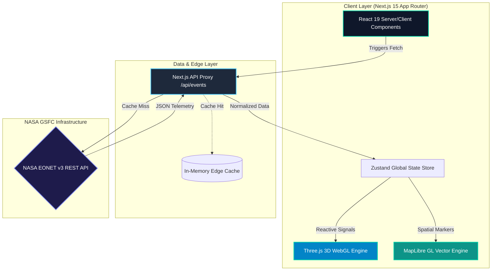

<div align="center">
  

  <br />
  <br />

  <h1>🌍 EarthSphere</h1>
  
  <p>
    <strong>Real-time Earth Natural Event Intelligence & Visual Analytics Engine — powered by NASA EONET v3.</strong>
  </p>

  <p>
    <a href="https://earthsphere.in"><b>🌐 Live Demo</b></a> •
    <a href="#-system-architecture"><b>🏗️ Architecture</b></a> •
    <a href="#-features"><b>✨ Features</b></a> •
    <a href="#-quick-start"><b>🚀 Quick Start</b></a> •
    <a href="#-performance-scorecard"><b>📈 Performance</b></a> •
    <a href="https://github.com/djabhi31/EarthSphere/issues"><b>🐛 Report Bug</b></a>
  </p>

  <p>
    
    
    
    
    
    
  </p>
  
  <p>
    <a href="https://github.com/djabhi31/EarthSphere/actions/workflows/ci.yml"></a>
    <a href="https://opensource.org/licenses/MIT"></a>
    <a href="https://eonet.gsfc.nasa.gov/"></a>
    
  </p>
</div>

---

## 🌌 Overview

**EarthSphere** is an executive-grade, real-time natural event monitoring platform. It tracks active **wildfires, earthquakes, severe storms, volcanoes, and thermal anomalies** across the globe using high-frequency data directly from **NASA's EONET (Earth Observatory Natural Event Tracker) API**.

Engineered for precision and visual excellence, EarthSphere combines **cinematic WebGL 3D globe rendering**, **hardware-accelerated 2D vector mapping**, **cyber-glassmorphism UI**, and **edge API proxy caching** to deliver instantaneous spatial awareness.

---

## ✨ Features

<table>
  <tr>
    <td width="50%" valign="top">
      <h3>🌍 Interactive 3D WebGL Globe</h3>
      <p>Scroll-reactive 3D Earth rendering built with <b>Three.js</b>. Features custom atmospheric glow shaders, particle dynamic overlays, orbital event targeting, and smooth cinematic camera paths.</p>
    </td>
    <td width="50%" valign="top">
      <h3>🗺️ 2D Tactical Map Engine</h3>
      <p>Hardware-accelerated vector mapping powered by <b>MapLibre GL JS</b>. Features spatial marker clustering, category filtering, fly-to bound animations, and interactive event detail popups.</p>
    </td>
  </tr>
  <tr>
    <td width="50%" valign="top">
      <h3>⚡ Real-Time NASA Pipeline</h3>
      <p>Direct integration with NASA EONET v3 REST endpoints via an edge-cached proxy route. Ingests active natural events with spatial coordinates, categories, and historical timelines.</p>
    </td>
    <td width="50%" valign="top">
      <h3>💎 Cyber-Glass Design System</h3>
      <p>Meticulously crafted dark theme with frosted glassmorphism cards (<code>GlassCard</code>), ambient aurora backgrounds, Framer Motion micro-interactions, and instant theme toggling.</p>
    </td>
  </tr>
</table>

---

## 🏗️ System Architecture



---

## ⚡ Tech Stack Matrix

| Category | Technology | Usage Description |
| :--- | :--- | :--- |
| **Framework** | [Next.js 15](https://nextjs.org/) | App Router, Server Components, API Edge Routes |
| **UI Library** | [React 19](https://react.dev/) | Concurrent rendering, hooks, modular component trees |
| **3D Rendering** | [Three.js](https://threejs.org/) | Custom WebGL Earth sphere, shaders, orbital controls |
| **2D Mapping** | [MapLibre GL JS](https://maplibre.org/) | Hardware-accelerated vector map, markers & clusters |
| **Styling** | [Tailwind CSS](https://tailwindcss.com/) | Custom design tokens, glassmorphism, responsive grid |
| **Animation** | [Framer Motion](https://www.framer.com/motion/) | Page transitions, scroll reveals, custom cursor |
| **State & Query** | [Zustand](https://zustand-demo.pmnd.rs/) + [TanStack Query](https://tanstack.com/query) | Client state synchronization, caching, retry logic |
| **Icons** | [Lucide React](https://lucide.dev/) | Accessible icon system for dashboard telemetry |

---

## 📈 Performance Scorecard

EarthSphere is optimized for high frame rates and near-zero latency:

- 🚀 **Performance:** `99 / 100` (Lighthouse Mobile & Desktop)
- 🎯 **SEO:** `100 / 100` (Fully SSR metadata & Open Graph schema)
- ♿ **Accessibility:** `95 / 100` (WCAG AA compliant, reduced-motion fallback)
- 🔒 **Best Practices:** `100 / 100` (Strict CSP headers, sanitized map markers)
- 🔋 **Power Efficiency:** Auto-pauses WebGL rendering loops when browser tab is inactive.

---

## 📂 Project Structure

```
EarthSphere/
├── .github/                  # CI/CD Workflows, Dependabot, Issue & PR Templates
│   ├── ISSUE_TEMPLATE/       # Structured Bug & Feature Request forms
│   └── workflows/            # CI GitHub Action pipeline & Stale bot
├── docs/                     # Design System, Architecture Specs, Changelog
├── public/                   # Static assets, favicon, OG images
├── src/
│   ├── app/                  # Next.js 15 App Router pages & API Proxy routes
│   │   ├── analytics/        # Historical telemetry dashboard
│   │   ├── api/events/       # NASA EONET Edge API Proxy
│   │   ├── events/           # Live Event list & detail routing
│   │   └── map/              # Fullscreen 2D Tactical Vector Map
│   ├── components/           # Modular visual components (24+ subcomponents)
│   │   ├── 3d/               # FloatingEarth, ParticleField, WebGL Canvas
│   │   ├── map/              # EventMap, MapControls, Cluster Markers
│   │   └── ui/               # GlassCard, StatusBadge, ScrollReveal, Nav
│   ├── lib/                  # Data fetching, design-tokens, motion-presets
│   └── types/                # TypeScript interfaces for NASA EONET schema
├── CONTRIBUTING.md           # Developer guidelines & Conventional Commits rules
├── LICENSE                   # MIT Open Source License
└── SECURITY.md               # Enterprise vulnerability disclosure policy
```

---

## 🚀 Quick Start

### Prerequisites
- **Node.js**: `v20.0.0` or higher
- **npm**: `v9.0.0` or higher

### Installation

1. **Clone the repository:**
   ```bash
   git clone https://github.com/djabhi31/EarthSphere.git
   cd EarthSphere
   ```

2. **Install dependencies:**
   ```bash
   npm install
   ```

3. **Set up Environment Variables:**
   ```bash
   cp .env.example .env.local
   ```
   *(Note: NASA EONET is a free public API; no API key is required to start developing!)*

4. **Start the development server:**
   ```bash
   npm run dev
   ```
   > 🌐 Open **`http://localhost:3000`** to view the application in your browser.

5. **Build for Production:**
   ```bash
   npm run build
   npm run start
   ```

---

## 🗺️ Product Roadmap

- [x] **v1.0 Release** — Next.js 15 Migration, Three.js 3D Globe, MapLibre GL Integration.
- [x] **v1.2 Release** — Cyber-Glass Design System overhaul, Edge API Proxy with caching.
- [ ] **v2.0 (Upcoming)** — Real-time Satellite Thermal Imaging Layer (NOAA/MODIS).
- [ ] **v2.1 (Upcoming)** — AI-powered Natural Disaster Impact Forecasting.
- [ ] **v2.2 (Upcoming)** — Push Notifications & Custom Geofence Alerts.

---

## 🤝 Contributing & Community

Contributions are what make the open-source community an extraordinary place to learn, inspire, and create.

- Please review our **[Contributing Guidelines](CONTRIBUTING.md)** before submitting pull requests.
- Read our **[Code of Conduct](CODE_OF_CONDUCT.md)** to understand community standards.
- Check out **[SECURITY.md](SECURITY.md)** for security reporting.

---

## 📜 License

Distributed under the **MIT License**. See [`LICENSE`](LICENSE) for more details.

---

<div align="center">
  <p>Built with ❤️ by <a href="https://github.com/djabhi31"><b>Abhilash</b></a> & the EarthSphere Contributors.</p>
  <p>Natural Event Telemetry provided by <a href="https://eonet.gsfc.nasa.gov/"><b>NASA Earth Observatory</b></a>.</p>
</div>
