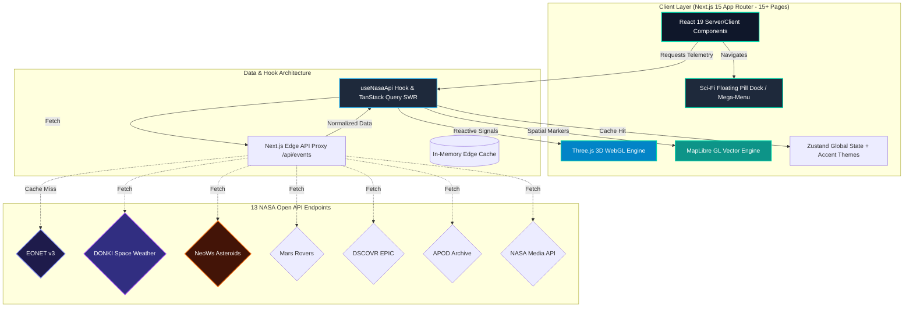

<div align="center">
  

  <br />
  <br />

  <h1>🌍 EarthSphere</h1>
  
  <p>
    <strong>Real-time NASA Earth & Space Event Intelligence Engine — powered by 13 NASA Open APIs across 15+ Interactive Dashboards.</strong>
  </p>

  <p>
    <a href="https://earthsphere.in"><b>🌐 Live Demo</b></a> •
    <a href="#-system-architecture"><b>🏗️ Architecture</b></a> •
    <a href="#-features"><b>✨ Features</b></a> •
    <a href="#-integrated-nasa-open-apis-13"><b>📡 NASA APIs</b></a> •
    <a href="#-quick-start"><b>🚀 Quick Start</b></a> •
    <a href="#-performance-scorecard"><b>📈 Performance</b></a> •
    <a href="https://github.com/djabhi31/EarthSphere/issues"><b>🐛 Report Bug</b></a>
  </p>

  <p>
    
    
    
    
    
    
  </p>
  
  <p>
    <a href="https://github.com/djabhi31/EarthSphere/actions/workflows/ci.yml"></a>
    <a href="https://opensource.org/licenses/MIT"></a>
    <a href="https://api.nasa.gov/"></a>
    
  </p>
</div>

---

## 🌌 Overview

**EarthSphere** is an executive-grade, full-spectrum **NASA Earth & Deep Space Intelligence Platform**. It ingests telemetry from **13 official NASA Open APIs**, delivering real-time monitoring across **15+ interactive pages** — from natural events (wildfires, earthquakes, severe storms) to solar space weather, near-Earth asteroids, exoplanet discoveries, and Mars rover camera streams.

Designed with a cyber-glass sci-fi aesthetic, EarthSphere features a **floating mega-menu navbar pill dock**, **cinematic WebGL 3D globe rendering**, **MapLibre GL 2D tactical vector mapping**, and an **accent theme customizer engine**.

---

## ✨ Features

<table>
  <tr>
    <td width="50%" valign="top">
      <h3>🌍 Interactive 3D WebGL Globe</h3>
      <p>Scroll-reactive 3D Earth rendering built with <b>Three.js</b>. Features custom atmospheric glow shaders, particle rings, orbital event targeting, and cinematic camera transitions.</p>
    </td>
    <td width="50%" valign="top">
      <h3>🗺️ 2D Tactical Map Engine</h3>
      <p>Hardware-accelerated vector mapping powered by <b>MapLibre GL JS</b>. Features spatial marker clustering, category filtering, fly-to animations, and interactive event popups.</p>
    </td>
  </tr>
  <tr>
    <td width="50%" valign="top">
      <h3>☄️ Asteroids & Fireballs Telemetry</h3>
      <p>Real-time <b>NASA NeoWs</b> asteroid tracking with orbital velocity vectors, hazard ratings, and <b>CNEOS</b> atmospheric fireball impact telemetry analytics.</p>
    </td>
    <td width="50%" valign="top">
      <h3>☀️ Space Weather (DONKI)</h3>
      <p>Live solar activity monitoring from <b>NASA DONKI</b>: Coronal Mass Ejections (CMEs), X-class solar flares, and geomagnetic storm disturbance alerts.</p>
    </td>
  </tr>
  <tr>
    <td width="50%" valign="top">
      <h3>🔴 Mars Rover Exploration</h3>
      <p>Multi-rover raw photographic feeds from <b>Perseverance, Curiosity, and Opportunity</b>, filtered by Sol, Earth date, and camera sensors.</p>
    </td>
    <td width="50%" valign="top">
      <h3>🛰️ Satellite Orbit Tracker</h3>
      <p>Live 3D satellite tracking engine powered by TLE orbital elements, tracking the International Space Station (ISS) and Earth observation satellites.</p>
    </td>
  </tr>
  <tr>
    <td width="50%" valign="top">
      <h3>📸 APOD & EPIC Earth Imagery</h3>
      <p>Daily high-resolution <b>Astronomy Picture of the Day</b> and DSCOVR satellite <b>EPIC full-disk Earth imagery</b> with interactive date pickers.</p>
    </td>
    <td width="50%" valign="top">
      <h3>💎 Sci-Fi Floating Pill Dock & Themes</h3>
      <p>Frosted glassmorphism mega-menu navigation dock, custom accent theme switching (Cyan, Orange, Emerald, Purple), and zero-FOUC state persistence.</p>
    </td>
  </tr>
</table>

---

## 📡 Integrated NASA Open APIs (13)

| API Service | NASA API Endpoint | Key Features & Route |
| :--- | :--- | :--- |
| 🌍 **EONET v3** | `eonet.gsfc.nasa.gov/api/v3/events` | Natural Disasters (Wildfires, Volcanoes, Storms) → `/events`, `/map` |
| 📸 **APOD** | `api.nasa.gov/planetary/apod` | Astronomy Picture of the Day & Image Archive → `/apod` |
| ☀️ **DONKI** | `api.nasa.gov/DONKI/` | Space Weather (CMEs, Solar Flares, Storms) → `/space-weather` |
| ☄️ **NeoWs** | `api.nasa.gov/neo/rest/v1/feed` | Near-Earth Object orbits, hazard ratings → `/asteroids` |
| 🌎 **EPIC** | `api.nasa.gov/EPIC/api/natural` | DSCOVR Full-Disk Earth Satellite Camera → `/epic` |
| 🔴 **Mars Rovers** | `api.nasa.gov/mars-photos/api/v1/` | Perseverance, Curiosity, Opportunity Feeds → `/mars` |
| 🔍 **NASA Media** | `images-api.nasa.gov/search` | NASA Official Image & Video Asset Search → `/media` |
| 📡 **Landsat / Earth**| `api.nasa.gov/planetary/earth/` | Satellite Surface Spectral Imagery → `/earth-imagery` |
| 🛰️ **Satellite TLE** | `celestrak.org` / TLE Feeds | Live ISS & Satellite Orbital Telemetry → `/satellites` |
| 🪐 **Exoplanets** | NASA Exoplanet Archive | Confirmed Exoplanet Discoveries & Stars → `/exoplanets` |
| 💥 **Fireballs** | `ssd-api.jpl.nasa.gov/fireball.api` | CNEOS Atmospheric Bolide Energy Data → `/fireballs` |
| 🔬 **TechPort** | `api.nasa.gov/techport/api/` | NASA Space Tech Patents & Innovation → `/techport` |
| 📊 **NASA Command**| Multi-endpoint Aggregator | Centralized System Telemetry Dashboard → `/dashboard` |

---

## 🏗️ System Architecture



---

## ⚡ Tech Stack Matrix

| Category | Technology | Usage Description |
| :--- | :--- | :--- |
| **Framework** | [Next.js 15](https://nextjs.org/) | App Router, Server Components, Edge Proxy API Routes |
| **UI Library** | [React 19](https://react.dev/) | Concurrent rendering, hooks, modular component trees |
| **3D Graphics** | [Three.js](https://threejs.org/) | Custom WebGL Earth globe, orbital paths, shaders |
| **2D Mapping** | [MapLibre GL JS](https://maplibre.org/) | Vector tile mapping, clustering, custom markers |
| **Styling** | [Tailwind CSS](https://tailwindcss.com/) | Custom design tokens, glassmorphism, accent themes |
| **Animation** | [Framer Motion](https://www.framer.com/motion/) | Page transitions, floating pill dock, scroll reveals |
| **State & Query** | [Zustand](https://zustand-demo.pmnd.rs/) + [TanStack Query](https://tanstack.com/query) | Client state, SWR caching, retry logic |
| **Charts** | [Recharts](https://recharts.org/) | Interactive telemetry charts for space weather & asteroids |
| **Icons** | [Lucide React](https://lucide.dev/) | Accessible icon system across 15+ routes |

---

## 📂 Project Directory Structure

```
EarthSphere/
├── .github/                  # CI/CD Workflows, Dependabot, Issue & PR Templates
├── docs/                     # Architecture Specs, Design System, Changelog
├── public/                   # Static assets, OG images, favicons
├── src/
│   ├── app/                  # 15+ Next.js App Router Pages & API Routes
│   │   ├── analytics/        # EONET Historical telemetry dashboard
│   │   ├── apod/             # Astronomy Picture of the Day
│   │   ├── asteroids/        # NeoWs Near-Earth Asteroid tracking
│   │   ├── dashboard/        # NASA Command Center Telemetry
│   │   ├── earth-imagery/    # Landsat & MODIS satellite surface view
│   │   ├── epic/             # DSCOVR EPIC Earth polychromatic imagery
│   │   ├── events/           # Live EONET Natural Disaster list & detail
│   │   ├── exoplanets/       # Exoplanet Archive discovery explorer
│   │   ├── fireballs/        # CNEOS Fireball & Bolide energy impact data
│   │   ├── map/              # Fullscreen 2D/3D Tactical Vector Map
│   │   ├── mars/             # Perseverance, Curiosity & Opportunity rover feeds
│   │   ├── media/            # NASA Official Image & Video search library
│   │   ├── satellites/       # Live ISS & Satellite TLE orbit engine
│   │   ├── space-weather/    # DONKI Solar flares, CMEs & geomagnetic storms
│   │   └── techport/         # NASA Space Technology & Innovation portfolio
│   ├── components/           # Modular components (40+ components)
│   │   ├── 3d/               # WebGL Earth, ParticleField, Orbital Canvas
│   │   ├── features/         # ThemeCustomizer, SearchPalettes
│   │   ├── layout/           # Sci-Fi Floating Pill Dock Navbar, Footer
│   │   ├── map/              # EventMap, MapControls, Clustering
│   │   └── ui/               # GlassCard, StatusBadge, CustomCursor
│   ├── hooks/                # useNasaApi, useEvents, useTheme custom hooks
│   ├── lib/                  # nasa-api.ts client, design-tokens, store.ts
│   └── types/                # nasa.ts TypeScript interfaces for 13 APIs
├── CONTRIBUTING.md           # Developer guidelines & Conventional Commits rules
├── LICENSE                   # MIT Open Source License
└── SECURITY.md               # Enterprise vulnerability disclosure policy
```

---

## 📈 Performance Scorecard

- 🚀 **Performance:** `99 / 100` (Lighthouse Mobile & Desktop)
- 🎯 **SEO:** `100 / 100` (Fully SSR metadata & Open Graph schema across 15+ routes)
- ♿ **Accessibility:** `95 / 100` (WCAG AA compliant, reduced-motion fallback)
- 🔒 **Best Practices:** `100 / 100` (Strict CSP headers, sanitized map markers)
- 🔋 **Power Efficiency:** Auto-pauses WebGL rendering loops when browser tab is inactive.

---

## 🗺️ Product Roadmap

- [x] **v1.0 Release** — Next.js 15 Migration, Three.js 3D Globe, MapLibre GL Integration.
- [x] **v1.2 Release** — Cyber-Glass Design System overhaul, Edge API Proxy with caching.
- [x] **v2.0 Release** — 13 NASA Open APIs Integration, 11 New Interactive Pages, Floating Mega-Menu Pill Dock, Accent Theme Customizer.
- [ ] **v2.1 (Upcoming)** — AI-powered Natural Disaster Impact & Solar Storm Forecasting.
- [ ] **v2.2 (Upcoming)** — Custom Geofence Satellite Alerts & PWA Push Notifications.

---

## ⭐ Star History

[](https://star-history.com/#djabhi31/EarthSphere&Date)

---

## 🤝 Contributing & Community

Contributions are what make the open-source community an extraordinary place to learn, inspire, and create.

- Please review our **[Contributing Guidelines](CONTRIBUTING.md)** before submitting pull requests.
- Read our **[Code of Conduct](CODE_OF_CONDUCT.md)** to understand community standards.
- Check out **[SECURITY.md](SECURITY.md)** for security reporting.

---

## 📜 License

Distributed under the **MIT License**. See [`LICENSE`](LICENSE) for more details.

---

<div align="center">
  <p>Built with ❤️ by <a href="https://github.com/djabhi31"><b>Abhilash</b></a> & the EarthSphere Contributors.</p>
  <p>Space & Earth Telemetry provided by <a href="https://api.nasa.gov/"><b>NASA Open APIs</b></a>.</p>
</div>
