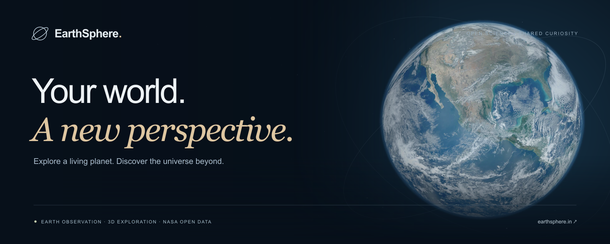
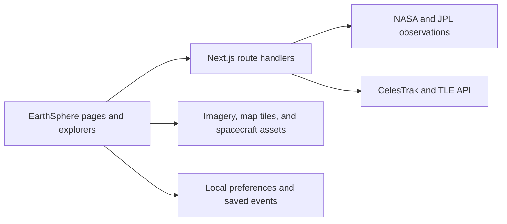

<div align="center">
  <a href="https://earthsphere.in">
    
  </a>

  <h1>EarthSphere</h1>
  <p><strong>An open window into Earth and space.</strong></p>
  <p>Explore natural events, orbit our planet, and discover the science behind the view.</p>

  <p>
    <a href="https://earthsphere.in"><strong>Explore the website</strong></a> ·
    <a href="#quick-start">Run locally</a> ·
    <a href="#features">Features</a> ·
    <a href="#data-sources">Data sources</a> ·
    <a href="#contributing">Contribute</a>
  </p>

  <p>
    <a href="https://github.com/djabhi31/EarthSphere/actions/workflows/ci.yml"></a>
    <a href="https://nextjs.org/"></a>
    <a href="https://react.dev/"></a>
    <a href="https://www.typescriptlang.org/"></a>
    <a href="LICENSE"></a>
  </p>
</div>

EarthSphere is an independent, open-source project that brings public NASA and partner observations into one place. It combines a cinematic introduction, an interactive Earth observatory, a native 3D explorer, and searchable science archives. Built by [Abhilash Ghosh](https://github.com/djabhi31), it is designed for anyone curious about our planet and the worlds beyond.

The wider suite offers three connected ways to explore:

| Experience | What you can explore | Website |
| --- | --- | --- |
| **EarthSphere** | Earth events, science imagery, spacecraft, and astronomy archives | [earthsphere.in](https://earthsphere.in) |
| **God’s Eye View** | A separate Cesium-based 3D geospatial console | [godseyeview.earthsphere.in](https://godseyeview.earthsphere.in) |
| **World Monitor** | A separate global news and intelligence dashboard, also accessible through `/intel` | [worldmonitor.earthsphere.in](https://worldmonitor.earthsphere.in) |

## Features

- **A journey through Earth and space.** Scroll through a Three.js landing experience with camera transitions, Earth and Mars scenes, and selectable NASA event observations.
- **An Earth observatory.** Explore clustered events on a MapLibre globe or flat map. Filter by category, status, and date; replay recorded observations; inspect event trails; save events; and share a view. Satellite, atlas, and relief basemaps sit alongside density, sunlight, and plate-boundary layers.
- **A native 3D Earth explorer.** Browse missions, spacecraft models, orbit paths, and 44 configured science-layer variants. Select observation dates, inspect numeric raster values where available, follow supported spacecraft, and export an attributed view. The interface is built in EarthSphere and draws on NASA’s public science resources.
- **A universe of searchable archives.** Discover astronomy pictures, Earth imagery, Mars photography, near-Earth objects, solar activity, exoplanets, fireballs, and NASA research projects, with links back to their sources.
- **A consistent experience.** A shared navigation bar and footer connect the pages. Responsive layouts, keyboard controls, reduced-motion support, theme preferences, and a local watchlist support different ways of exploring.

<details>
<summary><strong>Browse all 18 destinations</strong></summary>

<br />

| Area | Destination | What you’ll find |
| --- | --- | --- |
| Earth | [Natural events](https://earthsphere.in/events) | NASA EONET event feed and individual event details |
| Earth | [Event map](https://earthsphere.in/map) | Globe/flat map, filters, observation timeline, and event inspector |
| Earth | [3D Earth](https://earthsphere.in/explore) | Missions, science layers, spacecraft models, and orbit visualization |
| Earth | [Earth from space](https://earthsphere.in/epic) | DSCOVR/EPIC full-disk images and daily sequences |
| Earth | [Satellite imagery](https://earthsphere.in/earth-imagery) | NASA GIBS imagery by location, date, and layer |
| Earth | [Event analytics](https://earthsphere.in/analytics) | Event counts, categories, sources, and trends |
| Space | [Picture of the day](https://earthsphere.in/apod) | NASA’s Astronomy Picture of the Day archive |
| Space | [Mars exploration](https://earthsphere.in/mars) | A curated search of Mars mission photography in NASA’s media archive |
| Space | [Near-Earth asteroids](https://earthsphere.in/asteroids) | Close approaches, estimated sizes, distances, and velocities |
| Space | [Space weather](https://earthsphere.in/space-weather) | Solar flares, coronal mass ejections, and geomagnetic storms |
| Space | [Satellite catalog](https://earthsphere.in/satellites) | Spacecraft search and available orbital elements |
| Space | [Fireballs & bolides](https://earthsphere.in/fireballs) | Reported atmospheric fireballs and measured properties |
| Space | [Exoplanet archive](https://earthsphere.in/exoplanets) | Confirmed planets, host stars, and discovery information |
| Discover | [Mission control](https://earthsphere.in/dashboard) | Observation summaries and a searchable destination directory |
| Discover | [NASA media library](https://earthsphere.in/media) | Images, videos, audio, and original captions |
| Discover | [Technology portfolio](https://earthsphere.in/techport) | NASA technology projects and research records |
| Discover | [Global intelligence](https://earthsphere.in/intel) | Hosted World Monitor views and companion-platform links |
| Discover | [Our story](https://earthsphere.in/about) | The project’s perspective, creator, and sources |

</details>

## Quick start

You’ll need **Git**, **Node.js**, and **npm**. Node.js 22 or newer is recommended; the installed Next.js version requires at least Node.js 20.9. A browser with WebGL support is needed for the map and 3D experiences.

```bash
git clone https://github.com/djabhi31/EarthSphere.git
cd EarthSphere
npm ci
npm run dev
```

Open [http://localhost:3000](http://localhost:3000). The main application does not require a database or a local companion service. An internet connection is needed to retrieve external observations and imagery.

### Configure a NASA API key

Public resources such as EONET, NASA media, GIBS imagery, and mission metadata can be used without a NASA API key. Keyed NASA endpoints fall back to `DEMO_KEY`, which has shared request limits.

For regular use, request a key at [api.nasa.gov](https://api.nasa.gov/), create `.env.local` in the repository root, and add:

```dotenv
NASA_API_KEY=your_nasa_api_key
```

Restart the development server after changing the file. On a hosting platform, add the same variable in the project’s environment settings.

The NASA proxy reads `NASA_API_KEY` first, then the legacy `NEXT_PUBLIC_NASA_API_KEY`, then `DEMO_KEY`. Prefer the server-side `NASA_API_KEY` for new setups, and keep real keys out of commits. EONET uses NASA’s fixed v3 endpoint and needs no environment configuration.

## Development

| Command | Purpose |
| --- | --- |
| `npm run dev` | Start the Next.js development server |
| `npm run build` | Compile the production application and check TypeScript |
| `npm start` | Serve an existing production build |
| `npm run typecheck` | Run TypeScript without emitting application code |
| `npm run lint` | Run the repository’s ESLint configuration |
| `npm run test:site` | Run the site’s Node.js regression tests |

The regression suite covers data handling, source URL validation, camera paths, scientific decoding, orbital calculations, event filtering, UTC timelines, and geographic edge cases. It does not replace browser checks of rendering, touch controls, keyboard interaction, or responsive layouts.

The [current CI workflow](.github/workflows/ci.yml) installs dependencies, checks TypeScript, runs lint with non-blocking failures, and builds the application. Run `npm run test:site` locally as well; that command is not currently part of CI.

For a local production run:

```bash
npm run build
npm start
```

For deployment, use a host that supports **Next.js server route handlers**. A plain static-file host is insufficient because the application uses `/api/eonet`, `/api/nasa`, and `/api/explore`. Companion applications have separate deployment and provider requirements.

## How it’s built

| Layer | Technology |
| --- | --- |
| Application | Next.js 16 App Router, React 19, TypeScript |
| 3D rendering | Three.js, React Three Fiber, Drei, custom shaders |
| Mapping | MapLibre GL JS and GeoJSON |
| Motion and styling | Motion, Tailwind CSS 4, CSS modules |
| State and data | TanStack Query, Zustand, browser-local preferences |
| Charts and orbit calculations | Recharts, satellite.js |
| Server integration | Next.js route handlers with upstream fetching and caching |


```mermaid
flowchart LR
    UI["EarthSphere pages and explorers"] --> API["Next.js route handlers"]
    API --> NASA["NASA and JPL observations"]
    API --> ORBITS["CelesTrak and TLE API"]
    UI --> ASSETS["Imagery, map tiles, and spacecraft assets"]
    UI --> LOCAL["Local preferences and saved events"]
```

Structured data is fetched through the application’s route handlers. Imagery, map tiles, and some mission assets load directly from their providers. The native 3D explorer is inspired by [NASA Eyes on Earth](https://eyes.nasa.gov/apps/earth/); it is an independent implementation with its own interface and documented differences.

<details>
<summary><strong>Repository layout and companion workflows</strong></summary>

```text
EarthSphere/
├── src/
│   ├── app/                    # Pages, layouts, metadata, and API routes
│   ├── components/
│   │   ├── landing/journey/    # Current scroll-driven 3D landing page
│   │   ├── explore/            # Native Earth explorer and spacecraft views
│   │   ├── map/observatory/    # Event map, archive timeline, and inspector
│   │   └── site/               # Shared navigation, footer, and content pages
│   ├── hooks/                  # Queries and reusable client behavior
│   └── lib/                    # Data helpers, science, geography, and state
├── public/                     # Images, textures, map data, and model decoders
├── scripts/                    # Regression tests and companion maintenance tools
├── docs/                       # Design notes, source credits, and backups
├── gods-eye-view/              # Companion application source
└── .github/                    # CI, issue templates, and pull-request template
```

God’s Eye View is also maintained at [djabhi31/gods-eye-view](https://github.com/djabhi31/gods-eye-view). World Monitor is hosted separately and embedded by the `/intel` page.

The root `gev:start` and `gev:dev` scripts launch the included God’s Eye View application; follow its own setup instructions for dependencies and provider configuration. The `sync:gev` and `sync:wm` scripts are maintenance workflows that expect sibling checkouts. They are not part of the EarthSphere quick start. Review [sync-gev.mjs](scripts/sync-gev.mjs) and [sync-wm.mjs](scripts/sync-wm.mjs) before using them.

</details>

## Data sources

EarthSphere combines NASA services with community and commercial mapping providers. Each view links to its source where available.

| Provider | Used for |
| --- | --- |
| [NASA EONET](https://eonet.gsfc.nasa.gov/) | Natural-event records, categories, geometry, and observation histories |
| [NASA Open APIs](https://api.nasa.gov/) | APOD, NeoWs, and EPIC records |
| [NASA CCMC / DONKI](https://ccmc.gsfc.nasa.gov/tools/DONKI/) | Solar and geomagnetic event records |
| [NASA Eyes](https://eyes.nasa.gov/apps/earth/) and [GIBS](https://gibs.earthdata.nasa.gov/) | Mission metadata, observation archives, scientific layers, and imagery |
| [NASA Image and Video Library](https://images.nasa.gov/) | Media search, captions, playable assets, and Mars photography |
| [NASA / JPL CNEOS](https://cneos.jpl.nasa.gov/fireballs/) | Reported fireballs and bolides |
| [NASA Exoplanet Archive](https://exoplanetarchive.ipac.caltech.edu/) | Confirmed planets and associated stellar data |
| [NASA TechPort](https://techport.nasa.gov/) | Technology project records |
| [CelesTrak](https://celestrak.org/) and [TLE API](https://tle.ivanstanojevic.me/) | Orbital elements for supported spacecraft and catalog search |
| [Esri](https://www.esri.com/), [CARTO](https://carto.com/), and [OpenStreetMap](https://www.openstreetmap.org/copyright) | Reference basemaps and map labels |

### Understanding the observations

- **Publication schedules vary.** Source dates, archive availability, caching, and provider limits determine what is shown. Imagery and event records are not continuous live camera feeds.
- **Orbit positions are estimates.** Supported missions use SGP4 propagation from available TLEs. The explorer hides positions more than 14 days from an element set rather than presenting them as accurate historical tracking.
- **Map archives have boundaries.** Event queries are capped at 1,000 records, and unusable geometry is reported as omitted. Narrow the date window when the result limit is reached. The map’s archive cursor changes event observations and sunlight; it does not date-match the reference basemap.
- **Layer types differ.** Numeric point readouts apply to decoded scientific rasters. Image layers display imagery and available source legends. The Mars page searches NASA’s media archive, including photography and illustrations.

## Documentation

| Guide | Contents |
| --- | --- |
| [Native Earth explorer](docs/native-earth-explorer.md) | Missions, science layers, models, orbit behavior, and differences from NASA Eyes |
| [Earth observatory map](docs/map-observatory-redesign.md) | Map controls, historical observations, data limits, and attribution |
| [3D landing journey](docs/landing-3d-redesign.md) | Scroll-driven scene structure and motion behavior |
| [Content-page design](docs/content-editorial-redesign.md) | About, dashboard, imagery, archives, and shared styling |
| [Shared footer](docs/footer-redesign.md) | Navigation, creator links, motion, and responsive layouts |
| [Contributing guide](CONTRIBUTING.md) | Contribution workflow and commit conventions |
| [Security policy](SECURITY.md) | Private vulnerability-reporting instructions |
| [Previous README](docs/backups/readme-before-redesign/README.md) | Unmodified backup of the README before this redesign |

Earlier landing designs are also preserved at [`/landing-v1`](https://earthsphere.in/landing-v1) and [`/landing-classic`](https://earthsphere.in/landing-classic).

## Contributing

Contributions to code, documentation, accessibility, data handling, and visual design are welcome.

1. Read the [contributing guide](CONTRIBUTING.md) and [code of conduct](CODE_OF_CONDUCT.md).
2. Use an [issue template](https://github.com/djabhi31/EarthSphere/issues/new/choose) to report a reproducible bug or discuss a substantial change.
3. Fork the repository, make a focused change, and run the checks relevant to it. For visual changes, include desktop and mobile captures and check reduced-motion behavior.
4. Open a pull request using the [PR template](.github/PULL_REQUEST_TEMPLATE.md), explaining the resulting behavior and how you verified it.

For suspected vulnerabilities, use the private reporting channels in [SECURITY.md](SECURITY.md).

## License and credits

EarthSphere’s code is available under the **[MIT License](LICENSE)**. Bundled dependencies and companion applications retain their own licenses; provider data, imagery, models, and basemaps retain their respective terms and attribution requirements.

Thanks to NASA, JPL, the scientific missions and data providers behind these observations, and the open-source projects that make the application possible. See the [editorial image credits](public/images/editorial/README.md), [Earth texture credits](public/textures/explore/README.md), [map-data credits](public/map/README.md), [decoder notices](public/explore/decoders/NOTICE.md), and [README artwork notes](docs/assets/README.md).

EarthSphere is an independent project and is not affiliated with or endorsed by NASA.

---

<div align="center">
  <a href="https://github.com/djabhi31"></a>
  <p>Created and maintained by <a href="https://github.com/djabhi31"><strong>Abhilash Ghosh</strong></a>.</p>
  <p><a href="https://github.com/djabhi31">GitHub</a> · <a href="https://earthsphere.in/about">The story behind EarthSphere</a></p>
  <p><sub>Made on Earth. For the endlessly curious.</sub></p>
</div>
