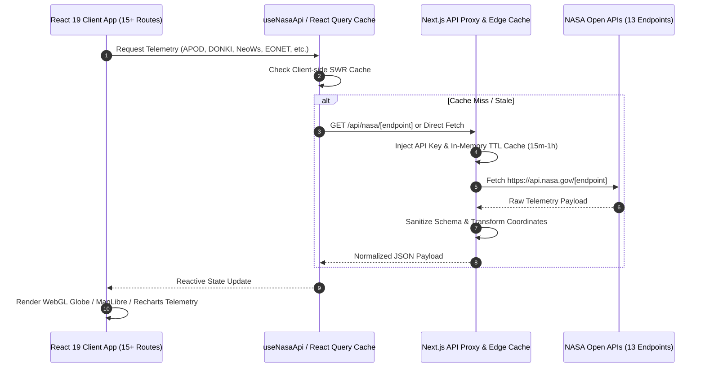

# 🏗️ EarthSphere System Architecture & Design Specification (v2.0.0)

**EarthSphere** is an executive-grade NASA Space & Earth Intelligence Platform built using Next.js 15 App Router, React 19, Three.js (WebGL), MapLibre GL JS, TanStack Query, and Zustand.

This document details the multi-API data architecture, edge proxy caching, 3D WebGL rendering pipeline, and 13 NASA Open API integrations.

---

## 📐 System Data Flow Architecture

---

## 🛰️ Integrated NASA Open APIs Matrix (13 Endpoints)

| API Service | Endpoint | Data Provided | Primary Route |
| :--- | :--- | :--- | :--- |
| **NASA EONET v3** | `/api/v3/events` | Natural Disasters (Wildfires, Volcanoes, Storms) | `/events`, `/map` |
| **APOD** | `/planetary/apod` | Astronomy Picture of the Day & Imagery Metadata | `/apod` |
| **DONKI** | `/DONKI/` | Space Weather (CMEs, Solar Flares, Geomagnetic Storms) | `/space-weather` |
| **NeoWs** | `/neo/rest/v1/feed` | Near-Earth Asteroid orbits, velocities, hazard ratings | `/asteroids` |
| **EPIC** | `/EPIC/api/natural` | DSCOVR Full-Disk Earth Polychromatic Imagery | `/epic` |
| **Mars Rover Photos** | `/mars-photos/api/v1/` | Perseverance, Curiosity, Opportunity Sol Camera Feeds | `/mars` |
| **NASA Image & Video** | `images-api.nasa.gov` | Media Archive Search across mission assets | `/media` |
| **Landsat / Earth** | `/planetary/earth/` | Satellite Surface Imagery & Spectral Tiles | `/earth-imagery` |
| **Satellite TLE Orbit** | `celestrak.org` / TLE | Live Satellite Orbits & ISS Trajectory vectors | `/satellites` |
| **NASA Exoplanets** | Exoplanet Archive | Confirmed Exoplanet Discoveries & Stellar Systems | `/exoplanets` |
| **CNEOS Fireballs** | `/fireball.api` | Atmospheric Bolide Impacts & Energy Telemetry | `/fireballs` |
| **NASA TechPort** | `/techport/api/` | Space Technology Projects & Innovation Patents | `/techport` |
| **NASA Command** | Multi-endpoint | Aggregated System Telemetry Dashboard | `/dashboard` |

---

## 🧩 Architectural Layers

### 1. Presentation & Graphics Layer
- **Sci-Fi Mega-Menu Floating Dock (`src/components/layout/Navbar.tsx`)**:
  - Glassmorphic floating navigation pill dock with animated active indicator layout tabs.
  - Multi-category mega-menu dropdown grouping Earth Monitoring, Deep Space, Missions, and Analytics.
- **Three.js WebGL Engine (`src/components/3d/FloatingEarth.tsx`)**:
  - Procedural atmosphere glow shaders, particle ring vectors, and orbital satellite tracking.
  - Auto-pauses render loop when browser tab loses focus to conserve GPU & battery power.
- **MapLibre GL Vector Engine (`src/components/map/EventMap.tsx`)**:
  - Hardware-accelerated 2D/3D Globe map projections.
  - Dynamic point clustering, heatmap density overlays, and auto-correcting coordinate sanitization.

### 2. Data Synchronization & Cache Layer
- **NASA API Service (`src/lib/nasa-api.ts` & `src/hooks/useNasaApi.ts`)**:
  - Centralized TypeScript client for all 13 NASA endpoints with fallback DEMO_KEY support, error boundaries, and exponential backoff retry logic.
- **Zustand Store (`src/lib/store.ts`)**:
  - Global client state managing active filters, timeline dates, accent theme colors, and user preferences.

### 3. Responsive Theme System (`src/app/globals.css` & `ThemeCustomizer.tsx`)
- Default dark-mode sci-fi aesthetic with dynamic CSS custom properties (`--electric-cyan`, `--solar-orange`, `--emerald-green`, `--cosmic-purple`).
- Zero-FOUC inline script prevention in `RootLayout`.
