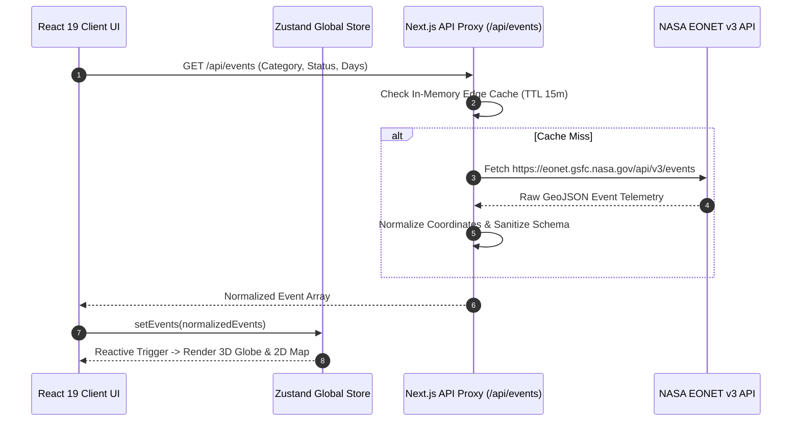

# 🏗️ EarthSphere System Architecture & Design Specification

**EarthSphere** is built using Next.js 15 App Router, React 19, Three.js (WebGL), MapLibre GL JS, and Zustand state management. This document outlines the technical architecture, data pipeline, rendering engines, and performance design decisions.

---

## 📐 System Data Flow

---

## 🧩 Architectural Layers

### 1. Presentation & Graphics Layer
- **Three.js WebGL Engine (`src/components/3d/FloatingEarth.tsx`)**:
  - Procedural atmosphere glow shaders.
  - Interactive orbital camera positioning reacting to selected natural event coordinates.
  - Pauses animation frame loop when browser tab loses focus to save GPU memory and battery power.
- **MapLibre GL Vector Engine (`src/components/map/EventMap.tsx`)**:
  - Hardware-accelerated vector tile rendering.
  - Automatic coordinate swap protection (swaps latitude/longitude if out of bounds).
  - Spatial point clustering and dynamic heatmap intensity overlays.

### 2. State & Cache Layer
- **Zustand (`src/lib/store.ts`)**:
  - Global client state for active event filters, timeline scrubber bounds, selected event IDs, and theme preferences.
- **TanStack Query (React Query)**:
  - Automatic background polling, retry strategies, and client-side stale-while-revalidate caching.

### 3. Edge API Proxy Layer (`src/app/api/events/route.ts`)
- Prevents CORS issues and buffers NASA EONET endpoint latency.
- Implements response compression and in-memory TTL caching.

---

## 🛡️ Security & Reliability Architecture

- **No Secret Key Dependencies:** NASA EONET is a public open dataset; no credentials required.
- **Sanitized DOM Content:** MapLibre popup markers generate HTML via safe `document.createElement()` and `textContent` bindings to prevent XSS.
- **Strict Bounds Validation:** Coordinates outside valid geographic bounds (`[-180, 180]`, `[-90, 90]`) are filtered before reaching WebGL or MapLibre engines to avoid WebGL context loss.
