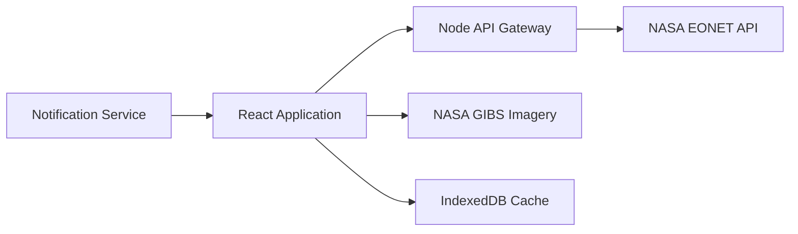

# EONET-Powered Earth Intelligence Platform

## Research Findings & Technical Documentation

## Executive Summary

NASA's **Earth Observatory Natural Event Tracker (EONET)** is an open API that provides continuously updated, near real-time metadata and satellite imagery references for natural events worldwide, including:

* Wildfires
* Severe Storms
* Floods
* Volcanic Activity
* Earthquakes
* Landslides
* Droughts
* Snow Events
* Sea & Lake Ice
* Dust and Haze Events
* Tropical Cyclones

The goal of this project is to build a world-class Earth Intelligence Platform utilizing all available EONET services, including Events, Categories, Sources, Layers, and Magnitudes.

The platform will feature:

* Interactive global event tracking
* Advanced geospatial visualization
* Real-time monitoring
* AI-powered insights
* Push notifications
* Offline synchronization
* Historical analytics
* Multi-role user management
* Satellite imagery overlays

---

# API Documentation

## Home Page

**URL:** `https://eonet.gsfc.nasa.gov/`

Purpose:

* Introduction to EONET
* Navigation to API resources
* Version information (v3.0 Stable)

Main Sections:

* Events
* Categories
* Sources
* Layers
* Magnitudes

---

## Events Endpoint

### List Events

```http
GET /api/v3/events
```

Returns all available events.

### Supported Parameters

| Parameter | Description         |
| --------- | ------------------- |
| status    | open / closed       |
| limit     | Number of results   |
| days      | Recent events       |
| start     | Start date          |
| end       | End date            |
| category  | Filter by category  |
| source    | Filter by source    |
| bbox      | Geographic boundary |
| magMin    | Minimum magnitude   |
| magMax    | Maximum magnitude   |

Example:

```http
GET /api/v3/events?status=open&limit=20
```

---

## Events GeoJSON

```http
GET /api/v3/events/geojson
```

Returns event data in GeoJSON format.

Contains:

* properties
* geometry
* geometryDates

Supported geometries:

* Point
* Polygon

---

## Event Details

```http
GET /api/v3/events/{eventId}
```

Returns detailed information for a single event.

Fields:

```json
{
  "id": "",
  "title": "",
  "description": "",
  "categories": [],
  "sources": [],
  "geometry": [],
  "magnitudeValue": null
}
```

---

## RSS & Atom Feeds

```http
GET /api/v3/events/rss
GET /api/v3/events/atom
```

Used for feed subscriptions and event monitoring.

---

## Categories Endpoint

### List Categories

```http
GET /api/v3/categories
```

Returns all available event categories.

Example Categories:

* Wildfires
* Volcanoes
* Floods
* Severe Storms
* Earthquakes
* Sea & Lake Ice

---

### Events by Category

```http
GET /api/v3/categories/{categoryId}
```

Example:

```http
GET /api/v3/categories/wildfires?status=open&limit=5
```

---

## Sources Endpoint

```http
GET /api/v3/sources
```

Returns all data providers.

Examples:

* NOAA
* NASA Earth Observatory
* InciWeb
* National Hurricane Center

Example Response:

```json
{
  "id": "InciWeb",
  "title": "InciWeb Incident Information",
  "source": "https://inciweb.nwcg.gov/"
}
```

---

## Layers Endpoint

### List All Layers

```http
GET /api/v3/layers
```

Returns satellite imagery layers mapped to event categories.

Layer Fields:

```json
{
  "name": "",
  "serviceUrl": "",
  "serviceTypeId": "",
  "parameters": []
}
```

---

### Layers by Category

```http
GET /api/v3/layers/{categoryId}
```

Example:

```http
GET /api/v3/layers/wildfires
```

Used for loading NASA GIBS imagery overlays.

---

# Data Model

## Event Object

```json
{
  "id": "EONET_20098",
  "title": "Tasmania Wildfire",
  "categories": [
    {
      "id": "wildfires",
      "title": "Wildfires"
    }
  ],
  "sources": [
    {
      "id": "EO"
    }
  ],
  "geometry": [
    {
      "date": "2023-04-09T00:00:00Z",
      "type": "Point",
      "coordinates": [145.4, -42.7]
    }
  ]
}
```

### Event Fields

| Field          | Type   |
| -------------- | ------ |
| id             | String |
| title          | String |
| description    | String |
| link           | URL    |
| closed         | Date   |
| categories     | Array  |
| sources        | Array  |
| geometry       | Array  |
| magnitudeValue | Number |

---

# Visualization Recommendations

## Wildfires

Visualization:

* Red markers
* Heatmaps
* Satellite fire overlays

## Volcanoes

Visualization:

* Volcanic icons
* Ash cloud layers
* SO₂ overlays

## Severe Storms

Visualization:

* Animated storm paths
* Wind intensity overlays

## Sea & Lake Ice

Visualization:

* Semi-transparent blue polygons
* Ice concentration layers

---

# Core Features

## Event Discovery

Users can filter events using:

* Category
* Source
* Status
* Date range
* Magnitude
* Geographic region

---

## Interactive World Map

Features:

* Zoom & Pan
* Marker Clustering
* Layer Switching
* Satellite Imagery
* Event Popups

---

## Event Detail Pages

Displays:

* Title
* Description
* Timeline
* Sources
* Geometry history
* Satellite layers

---

## Alerts & Notifications

Users can subscribe to:

* Categories
* Locations
* Magnitude thresholds

Delivery methods:

* Web Push
* Email
* Mobile Notifications

---

## User Management

Roles:

### Guest

* Browse events

### Registered User

* Save filters
* Receive alerts

### Administrator

* Manage platform settings
* Monitor integrations

---

# Premium Features

## Real-Time Monitoring

* Auto refresh
* Live event updates
* Event tracking dashboard

---

## Offline Support

Technology:

* Service Workers
* IndexedDB

Capabilities:

* Offline browsing
* Background synchronization

---

## Analytics Dashboard

Includes:

* Event frequency analysis
* Historical comparisons
* Trend forecasting
* Magnitude distributions

---

## AI Features

### AI Event Summaries

Automatically generate:

* Incident descriptions
* Impact assessments
* Risk scores

---

### AI Trend Detection

Identify:

* Emerging disaster patterns
* Regional event clusters
* Seasonal trends

---

# UI / UX Specification

## Main Dashboard

Layout:

* Global Map
* Filter Sidebar
* Event Feed
* Search Bar

---

## Event Listing Page

Display Modes:

* Cards
* Table View
* Timeline View

---

## Event Detail Screen

Components:

* Event Overview
* Interactive Map
* Satellite Imagery
* Source References
* Timeline Visualization

---

## Notification Settings

Users can configure:

* Categories
* Regions
* Frequency
* Delivery methods

---

# Design System

## Components

* Navbar
* Sidebar Filters
* Event Cards
* Data Tables
* Interactive Maps
* Modal Windows
* Charts
* Notification Center

---

## Animations

### Map Effects

* Pulsing event markers
* Smooth clustering transitions

### Page Effects

* Scroll reveal animations
* Fade-in content
* Loading skeletons

---

## Accessibility

WCAG 2.1 AA Compliance

Includes:

* Keyboard navigation
* Screen reader support
* High contrast mode
* Colorblind-friendly palettes

---

# Recommended Technology Stack

## Frontend

* React.js
* Next.js
* TypeScript
* Tailwind CSS
* Framer Motion

---

## Mapping

* OpenLayers
* Leaflet
* CesiumJS
* NASA GIBS

---

## Backend

* Node.js
* Express.js
* PostgreSQL
* Redis

---

## State Management

* Redux Toolkit
* React Query

---

## Analytics

* D3.js
* Chart.js

---

## Offline Support

* Service Workers
* IndexedDB

---

# Architecture Diagram



---

# Future Roadmap

## Phase 1

* Event Explorer
* Interactive Map
* Category Filtering
* Event Details

## Phase 2

* User Accounts
* Alerts
* Offline Mode
* Saved Searches

## Phase 3

* AI Summaries
* Analytics Dashboard
* Historical Replay

## Phase 4

* 3D Earth Visualization
* Enterprise Monitoring
* Predictive Intelligence
* API Marketplace

---

# Conclusion

The NASA EONET ecosystem provides a rich collection of natural disaster and environmental event data suitable for building a next-generation Earth Intelligence Platform.

By combining EONET event feeds, NASA GIBS imagery services, modern mapping frameworks, AI-powered analytics, and premium user experiences, the platform can become a comprehensive solution for disaster monitoring, environmental intelligence, research, education, and public awareness.
